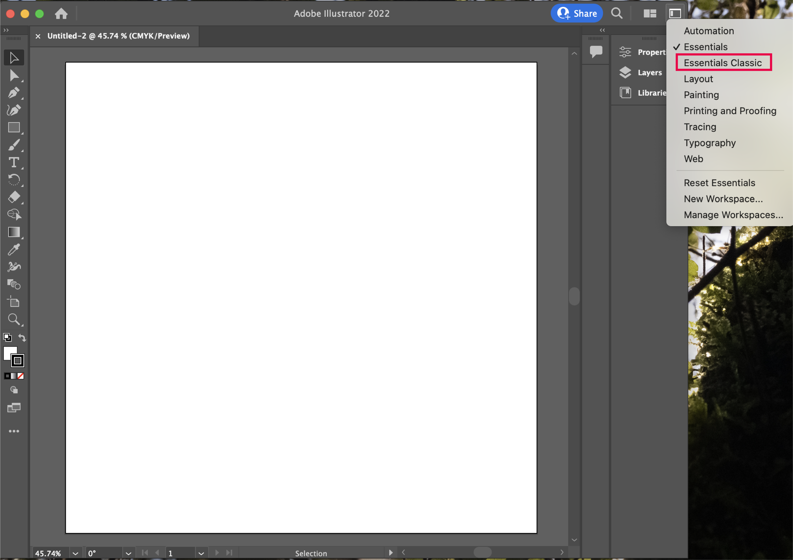
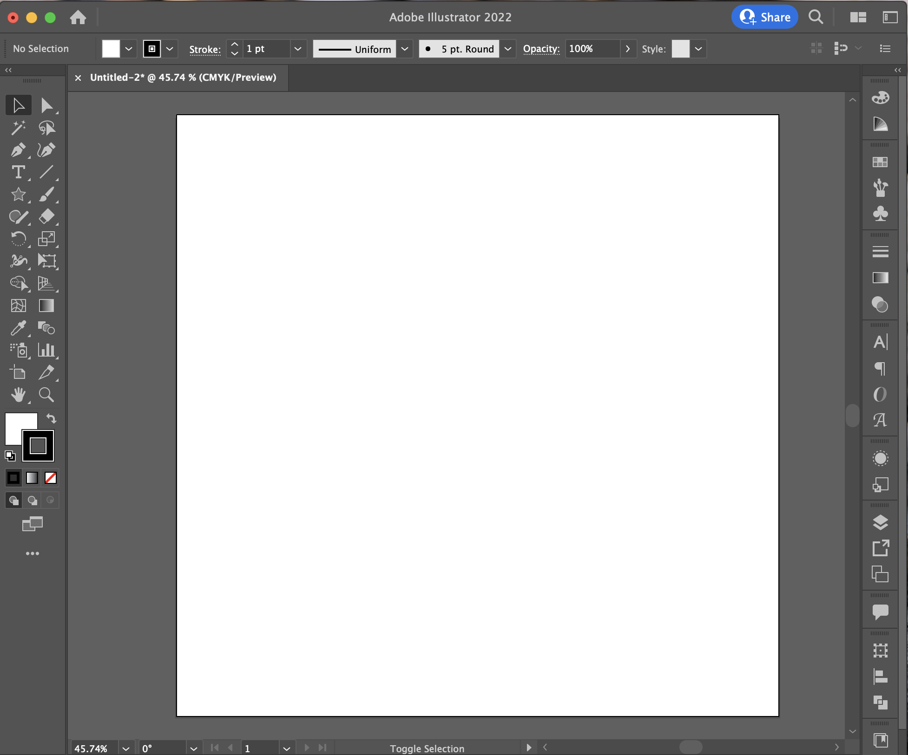
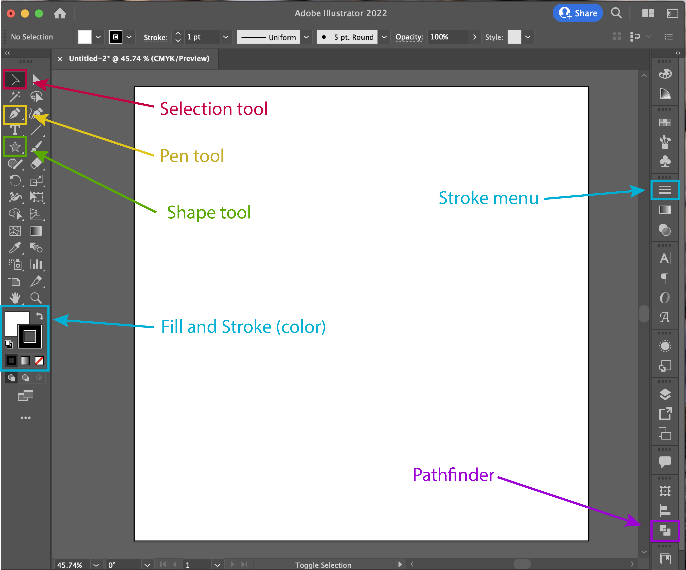

# Course Intro

The goal of this course is to teach you the bare minimum you need to make beautiful vector graphics. 

This course will cover...

- 3 tools:
	- [Shape Tool](https://elissasoroj.github.io/seeingis/shape/)
	- Pen Tool
	- Direct Selection Tool
- 2 menus:
	- Fill & Stroke
	- [Pathfinder](https://elissasoroj.github.io/seeingis/pathfinder/)

And that's it! 

## Orientation

To get started, let's set up our workspace and get oriented to the layout of the program. 

When you first open illustrator, it will ask you what size canvas to make. Although it may seem odd to choose a canvas size for a vector graphic, this is actually an important decision that will affect the rest of your process. 

### Canvas Size
As we discussed in the "What is a vector anyway?" section, vector graphics can be infinitely sized, but must often we output as raster files in order to be used by other applications. This is changing, but generally you should always plan to save your image out as a raster file. To figure out how big you should make your canvas, there are two approaches depending on the use of the image. 

1. **Digital**: if you are planning on using the image exclusively on screens (i.e. emails, presentations, twitter, etc...) then think about the **screen size** in **pixels**. Although it's tempting to just think about your own screen size, you should think about all the potential screens that may have your image on it, and cater to the largest one. Here are some common options: 
	* a macbook pro laptop with Retina display has dimensions 3456×2234 px
	* an HDTV (1080p): 1920×1080 px 
	* 4K: 3840x2160  px

	Now, consider how big you want your image to be on the screen. A little icon may only ever take up a tiny fraction of the screen, while a large image should have the longer dimension scaled to the size of the screen. 

	For example, say I want to design an image that has a W:L ratio of 8:2 for a 4K screen. I would need to make sure the width of my canvas was at least 2000px, making my height 500px. Now consider I want to make an image with W:L of 2:8 - my height should be about 3800px and that makes the width 950px. 

2. **Printed**: if you are planning to print your image, then we will use a piece of paper to help us figure out the dimensions. Think about how much of a piece of regular 8.5"x11" printer paper (approximately A4) you want your image to take up, and determine the dimension in inches. 
	* For an image that takes up a quarter of a piece of paper, I want 4.25"x5.5"
	* For an image that takes up half the length, but the full width of a page, I want 8.5"x5.5"
	* Techncially you can determine your image size in whatever units you want. If you think more naturally with cm or mm you can determine your image size in those units instead

Now, if you are making a digital image, set the units to pixels and simply enter the pixel dimensions

If you are making a printed image, then choose your units from the drop-down menu on the right (e.g. inches, cm, mm, etc...)
	
In order to get a high-resolution print, your image should have **300 pixels per inch**, which is also known as **300dpi** (dots-per-inch) or **300ppi** (points-per-inch). This is a useful standard to know. You can multiply your dimentions in inches by 300 manually to determine the pixel dimension, but Illustrator makes it easier than that. 

Under **Raster Effects** you can choose the ppi, and **300 ppi** is one of the standard choices. This will automatically scale the number of pixels in your canvas to the dimensions you indicated for the canvas size. 

#### Canvas Presets
As you can see, there are also standard presets that Illustrator presents to you, many of which should be familiar to you. 

You can choose any of these presets, and re-size the canvas down once it's open - but we won't cover that here.

If you make your own custom canvas, Illustrator will remember it and present it to you the next time you open the program. You can name and save presets for later if there is a common custom size you like to use. 

### Tutorial Canvas
For this tutorial, let's just keep it simple and make a small 800x800px canvas. Set the **Raster Effects** to **300dpi** and click **Create**. 

### Intro to the Illustrator Workspace

Your canvas will open as a white square on a dark grey background. Anything in front of the square will be part of your image, and everything on the grey will be hidden. This turns out to be an incredibly useful feature when you are making a new image. 

Once you have created your canvas, a new workspace will open. Illustrator automatically opens in the "Essentials" workspace, which has a limited set of tools and a flexible menu system to keep your workspace clean. You may find that this is your preferred workspace once you start using Illustrator regularly, but for the purposes of this little we are going to switch to "Classic Essentials", which shows you all the possible tools and menus. Click on the :ai-workspace-grey: symbol in the upper right to change the workspace to Classic Essentials.

Now, your workspace should look like this: 

The tools are on the left and the menus are on the right. The main color picker menu (Illustrator calls this "Fill & Stroke") is on the left below the tools. We will be using this menu often. 

The only tools and menus we will use are highlighted in the image below. Once you're familiar with the icons, you're all set to move on to the next section!

