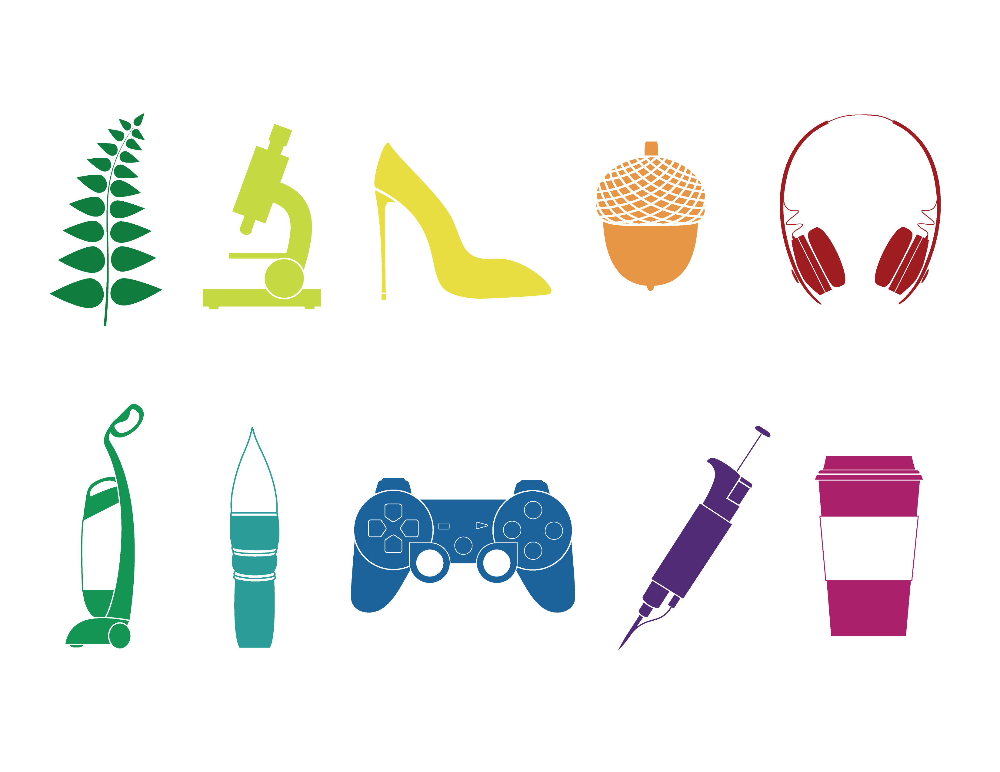

# **Project**: Pathfinder Icons

This project is designed to give you practice using the shapes tool and **Pathfinder**. It also ends up being a simple way to generate useful assets that you can use again and again. 

## Create an icon set using only shapes tools and pathfinder

You'll be surprised what you can achieve using just simple shapes and editing them using pathfinder. Try to find clever ways of creating complex forms by combining shapes together, or carving them out of eaach other. 

### Subject
There are many icons available online, but not many that likely apply to your specific area of study. Try to create icons that are unique and relevant to you and your work. 

### Style

Try to keep the style consistent, so that all the icons looks like they belong together. You can go with a simple "black outline" style, or use a more complex fill style, which utilizes the empty space between the shapes as design elements. 

Here are a few more tips to keep in mind while designing your icon: 

- It is a good idea to limit the colors to just one or two if you can. 
- Consider whether your shapes and lines tend to be rounded or sharp - and try to keep this consistent throughout the icon and across icons. 
- Keep your line weight similar throughout the icon. 

## Examples

This is an example of an icon set I made while I was in school for a very similar assignment. Although I used a few more techniques than you have learned up to this point, I mostly relied on the shapes tool and pathfinder.  

Don't be afraid to look online for other examples of both style and subject matter. I am a big fan of the [Github octicons](https://primer.style/octicons/). [Fontawesome](https://fontawesome.com/icons) also has a great icon library that you can use for inspiration. Make sure you are not copying other icons directly, but coming up with your own. 

You may also find it useful to use photos from google image as reference while you are designing your icons. 